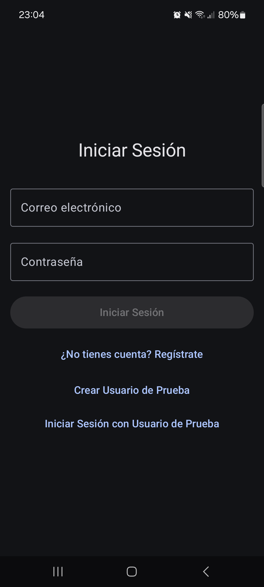
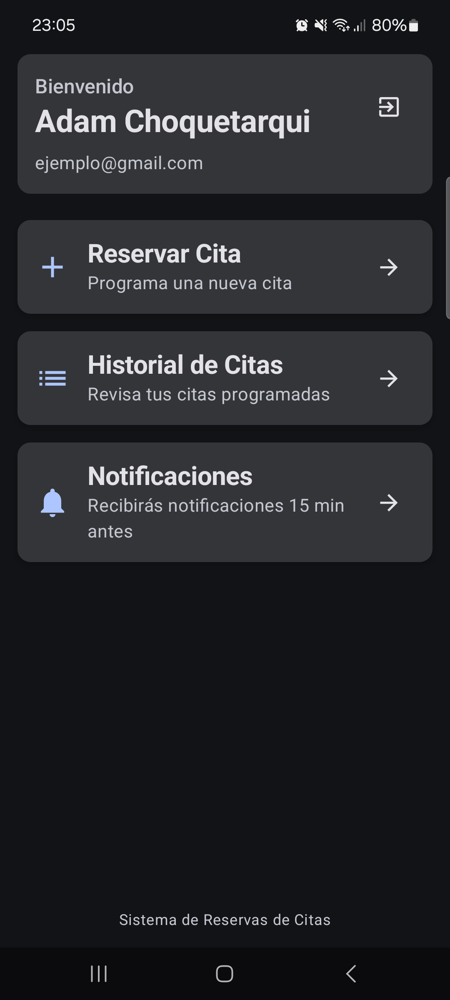
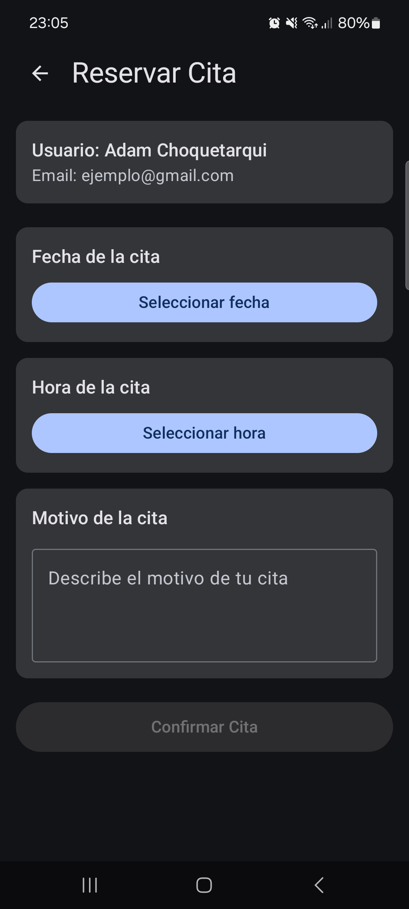
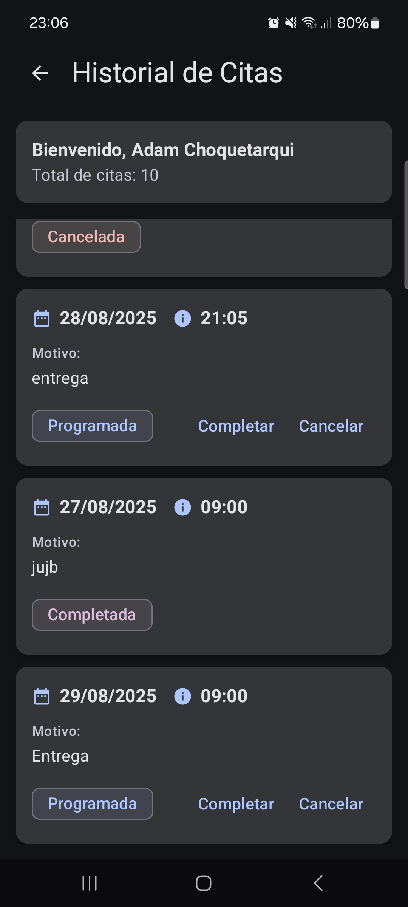

# Sistema de Reservas de Citas con Notificaciones

Una aplicación móvil Android desarrollada con Jetpack Compose que permite a los usuarios gestionar citas con notificaciones push.

## Datos

Universidad: Universidad Privada Domingo Savio
Carrera: Ingeniería de Sistemas
Materia: Aplicaciones Móviles I
Estudiante: Adam Fabio Choquetarui Villca

## Características

## Capturas de Pantalla

A continuación se muestran imágenes representativas de cada pantalla principal de la aplicación:

- **Pantalla de Autenticación:**
  
- **Pantalla Principal:**
  
- **Reserva de Cita:**
  
- **Historial de Citas:**
  

> Coloca tus imágenes en la carpeta `screenshots/` dentro del proyecto y actualiza los nombres de archivo si es necesario.
- ✅ **Base de datos remota** con Firebase Firestore
- ✅ **Reserva de citas** con selector de fecha y hora
- ✅ **Notificaciones push** usando Firebase Cloud Messaging (FCM)
- ✅ **Historial de citas** con gestión de estados
- ✅ **Interfaz moderna** usando Material Design 3 y Jetpack Compose
- ✅ **Compatibilidad** con Android Oreo (API 26) y versiones superiores

## Requisitos Previos

- Android Studio Arctic Fox o superior
- Android SDK 26+ (Android 8.0 Oreo)
- Cuenta de Google para Firebase
- Dispositivo Android o emulador

## Configuración de Firebase

### 1. Crear Proyecto Firebase

1. Ve a [Firebase Console](https://console.firebase.google.com/)
2. Crea un nuevo proyecto o usa uno existente
3. Habilita los siguientes servicios:
   - **Authentication** (Email/Password)
   - **Firestore Database**
   - **Cloud Messaging**

### 2. Configurar Android App

1. En Firebase Console, ve a "Project Settings" > "General"
2. Haz clic en "Add app" y selecciona Android
3. Ingresa el package name: `com.example.actividad7`
4. Descarga el archivo `google-services.json`
5. Coloca el archivo en la carpeta `app/` del proyecto

### 3. Configurar Firestore

1. Ve a "Firestore Database" en Firebase Console
2. Crea una base de datos en modo de prueba
3. Configura las reglas de seguridad:

```javascript
rules_version = '2';
service cloud.firestore {
  match /databases/{database}/documents {
    match /users/{userId} {
      allow read, write: if request.auth != null && request.auth.uid == userId;
    }
    match /appointments/{appointmentId} {
      allow read, write: if request.auth != null && 
        resource.data.userId == request.auth.uid;
    }
  }
}
```

## Instalación y Ejecución

### 1. Clonar el Proyecto

```bash
git clone <url-del-repositorio>
cd Actividad7
```

### 2. Configurar Firebase

- Reemplaza el archivo `app/google-services.json` con el tuyo
- Asegúrate de que el package name coincida

### 3. Sincronizar Dependencias

- Abre el proyecto en Android Studio
- Haz clic en "Sync Project with Gradle Files"
- Espera a que se descarguen todas las dependencias

### 4. Ejecutar la Aplicación

- Conecta un dispositivo Android o inicia un emulador
- Haz clic en "Run" (▶️) en Android Studio
- Selecciona tu dispositivo y espera a que se instale

## Estructura del Proyecto

```
app/src/main/java/com/example/actividad7/
├── data/                    # Clases de datos
│   ├── User.kt            # Modelo de usuario
│   └── Appointment.kt     # Modelo de cita
├── repository/             # Capa de datos
│   └── FirebaseRepository.kt
├── service/                # Servicios
│   └── FCMService.kt      # Servicio de notificaciones
├── viewmodel/              # Lógica de negocio
│   └── MainViewModel.kt
├── ui/screens/             # Pantallas de la UI
│   ├── AuthScreen.kt      # Autenticación
│   ├── MainScreen.kt      # Pantalla principal
│   ├── BookAppointmentScreen.kt  # Reserva de citas
│   └── AppointmentsHistoryScreen.kt  # Historial
└── MainActivity.kt         # Actividad principal
```

## Uso de la Aplicación

### 1. Registro/Inicio de Sesión

- La primera vez, crea una cuenta con email y contraseña
- En sesiones posteriores, inicia sesión con tus credenciales

### 2. Reservar Cita

- Desde la pantalla principal, toca "Reservar Cita"
- Selecciona una fecha (mínimo mañana)
- Elige una hora disponible
- Escribe el motivo de la cita
- Confirma la reserva

### 3. Ver Historial

- Toca "Historial de Citas" en la pantalla principal
- Revisa todas tus citas programadas
- Cambia el estado de las citas (Completar/Cancelar)

### 4. Notificaciones

- Recibirás notificaciones 15 minutos antes de cada cita
- Las notificaciones se muestran en la barra de estado
- Toca la notificación para abrir la aplicación

## Funcionalidades Técnicas

### Autenticación
- Firebase Auth con email/password
- Sesiones persistentes
- Cierre de sesión seguro

### Base de Datos
- Firestore para almacenamiento en la nube
- Sincronización en tiempo real
- Reglas de seguridad por usuario

### Notificaciones
- Firebase Cloud Messaging (FCM)
- Notificaciones locales programadas
- Canales de notificación para Android 8.0+

### UI/UX
- Jetpack Compose para interfaz moderna
- Material Design 3
- Navegación fluida entre pantallas
- Diseño responsive y accesible

